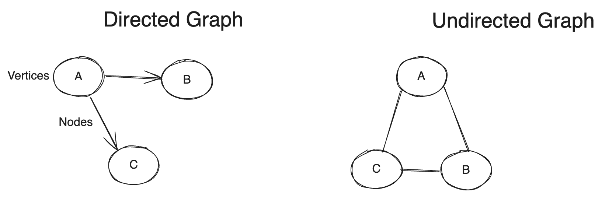
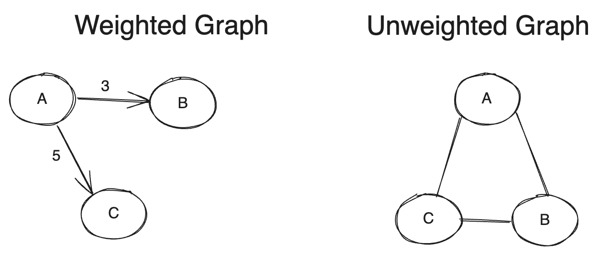
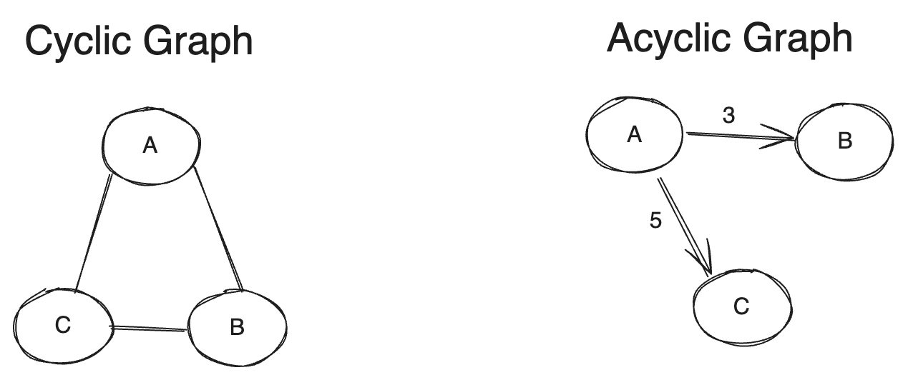

# Graph
* Graph is a set of Vertices and Edges. Vertices are also called as Nodes
* A graph is a set of (V,E) pairs
* A Tree is also a graph but a graph is not a tree
* A Tree will always have n-1 nodes as parent node but graph can have n number of parent node

## Terminlogy

### Node
* Node or vertices in a graph is represented as circles also known as nodes
* A, B, C, D are the vertices

### Edge
* Edges are represented as lines which connects the nodes
* (A, B) (A,C) (B,C) (B,D) are the edges in the above diagram

### Adjacent Nodes
* The edges connectin the nodes are adjacent nodes. For example for (A, B) edge 'A' and 'B' are adjacent nodes

### Degree of Nodes
* The number of edges connected to that node is called degree of node. For example D(A) is 2, D(B) is 2, D(C) is 2 and D(D) is 1

### Size of Graph
* The total number of edges in a graph. For ex, Size of the graph in the image is 4

### Path
* The sequence of vertices from source node to destination. For example, Path from A to C will be A->B->C or A->C

### Properties of Graph
Below are the types of Graph
    * Directed Graph & Undirected Graph
    * Weighted Graph & Unweighted Graph
    * Cyclic Graph & Uncyclic Graph

* Directed Graph are uni-directional. ie (A,B) != (B,A)
* Undirected Graph are bidirectional. ie (A,B) == (B,A)

When a cost is associated to an edge then it's a weigted graph. Weighted/Unweighted graph can be either directed or undirected

When a graph contains cycles then it's a cyclic graph. For Path A-B-C-A, the source and destination is same vector(A) so it's a cyclic graph. When the starting vector and destination vector of a path is same then it's a cyclic graph

A graph can have the combinational properties of Directed/Cyclic/Weighted graph