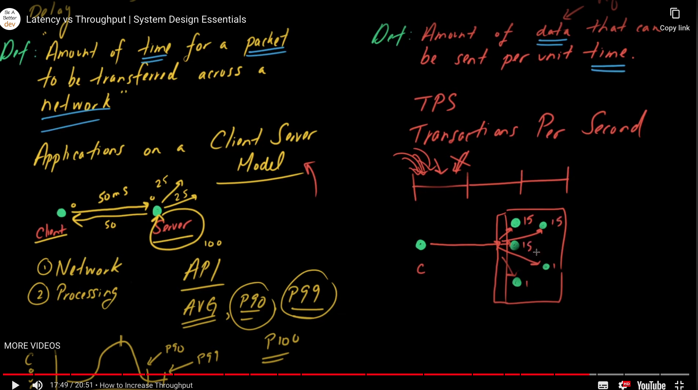

# System Design Primer Notes

## Trade Offs

### Performance vs Scalablilty
Performace is how the system performans for a single user

Scalability is how the system performs under load ie when multiple users use it

**Scalability**

Scalability can be achieved by horizontal or vertical scaling. Scaling helps to handle the increase in load.

Vertical Scaling

In vertical scaling the resources like vCPUs, RAMS, HDs are increased/scaled in a single server

Horizontal Scaling

In horizontal scaling the number of servers are increased. For example a website can be hosted in multiple server with a load balancer in front

Below are some of the scaling techniques,

* Load Balancer
* Caching
* Async Processing
* Clone of servers containing the application code
* Database Partition
* Database Replication
* Database Sharding

### Latency vs Throughput
**Latency** is the amount of time taken for packet to be transmitted

* In same building/datacenter 1ms
* In same continent 100ms

**Throughput** is the amount of data that can be sent per unit time. When running multiple instance of an app if it's tuned then TPS can be increased. Refer diagram,
        
* TPS - 1r/s
* TPS - 10r/s

**Bandwidth** is how much data volume is sent in a unit of time
* In 3G - 1Mb/s
* In 4G - 10 Mb/s

### Availability vs Consistency

#### CAP Theorem
**C**onsistency - **A**vailability - **P**artition Tolerant

CAP theorem formalizes th trade off between consistency and availability in the presense of partitions(network)
In a distributed system containing more than one node, CAP theorem states that during network failure ie when one or more nodes get's partitioned(isolated) then the system has to make a choice between Availabilty and Consistency.

There are three nodes in the distributed system, each sharing an integral state through replication. Assume the initial state on all three nodes as 0.

1. Write request sent to Node 1 to set state equal to 100.
2. Node 1 tries replicating the result to all the other nodes in the system.
3. Due to a network partition between Node 1 and 2, Node 2 does not receive the update and now holds the outdated state.
4. Node 2 receives a read request.

The system must now decide whether to return the outdated result or error.

* Consistency means that the system returns either the latest data or errors.
* Availability means that the system produces a non-error response every time.

CAP theorem states that such a system must choose between consistency and availability **in case of a network partition.**

* If a system decides to send a stale result during network failure then it's AP. Meaning it favours availability. Example - Cassandra
* If a system decides to send the latest data or error then it's CP. Meaning it's consistent. Example - Postgres

When designing system say a upvote buttton in reddit AP can be preffered. But for a banking application CP should be preferred.

https://vrongmeal.com/blog/everything-about-cap-theorem

https://www.the-paper-trail.org/page/cap-faq/

**Consistency Patterns**

Below are some of the consistency patterns that can be followed to build a system that is consistent ie In a distributed system, all reads after write is consistent

* Weak Consistency - A system may or may not give a consistent read after a write. Ex, VOIP/Video Calls/Video games where after a disconnect we won't know the previous conversation missed due to network lag

* Eventual Consistency - The system will eventually provide a consistent read after a write after some delay of milliseconds or seconds. The data is asyncronously sent across other nodes in the system Ex E-mail

* Strong Consistency - The system will alwasy provide a consistent read after a write. Ex RDMS and other databases

**Availabilty Patterns**

There are two complementory patterns used to support high availablilty - fail over and replication. It's measured as 99.9, 99.99, 99.999s - 3, 4 and 5 Nines

* Active-Passive/Master-Slave
* Active-Active/Master-Master

In sequence

Overall availability decreases when two components with availability < 100% are in sequence:

``Availability (Total) = Availability (Foo) * Availability (Bar)``

If both Foo and Bar each had 99.9% availability, their total availability in sequence would be 99.8%.

In parallel

Overall availability increases when two components with availability < 100% are in parallel:

``Availability (Total) = 1 - (1 - Availability (Foo)) * (1 - Availability (Bar))``

If both Foo and Bar each had 99.9% availability, their total availability in parallel would be 99.9999%.

### PACELC Theorem

#### Resources
[System Design One for templates](https://github.com/systemdesign42/system-design/)

[Latency vs Throughput](https://www.youtube.com/playlist?list=PL9nWRykSBSFjU7UGR37SFfOb1oMYLNhag)
