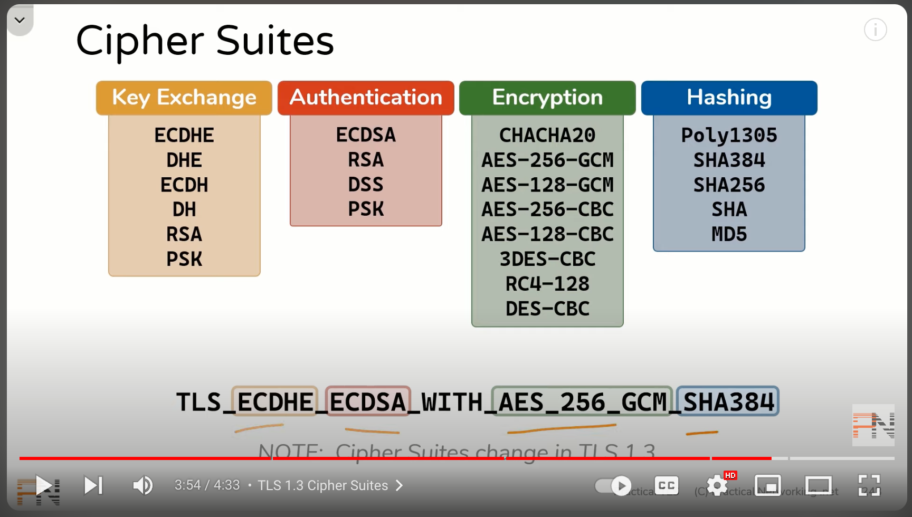
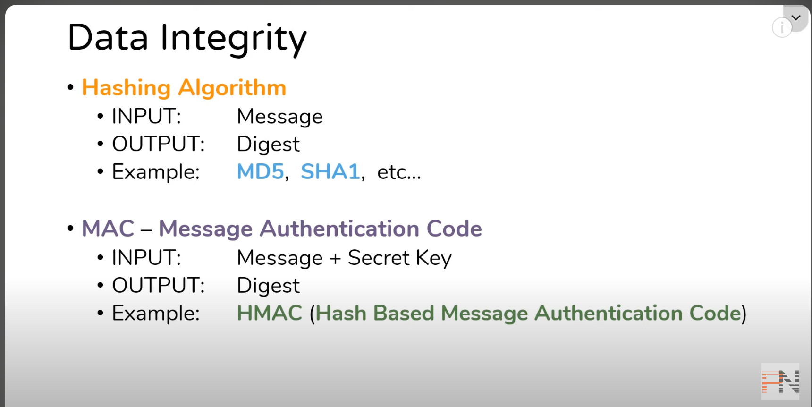
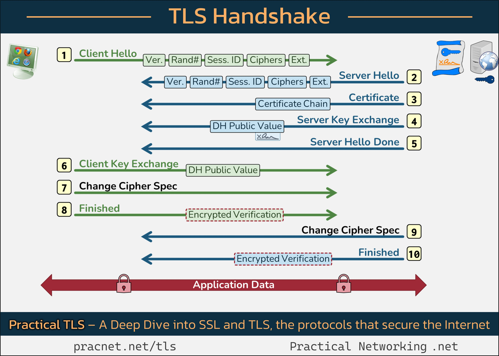

# SSL/TLS Handshake

## Introduction

SSL/TLS Handshake happens when a client establishes the connection with the server. The handshake is responsible for Privacy, integrity, and identification of the communication between the client and the server.

The words SSL and TLS are used interchangeably. SSL is the older spec and TLS is the recent. SSL v3 is TLS v1.1. The current spec version is TLS 1.3

Before learning about SSL/TLS Handshake, it's important to understand the below terminologies.

- Client and Server
- Cipher Suites
- Certificates
    - X.509
    - DV, OV and EV
- Certificate Authority
    
- Certificate Chaining
- Symetric Encryption
- Asymetric Encryption
    - Public and Private Key
- Hashing & HMAC
- Keystore
- Truststore
- Mutual TLS

### Client and Server
The client is the system or machine which initiates the connection. Ex, Browser/Postman/Client App.

The server is the system or machine which servers the response. Ex, NginX, Tomcat etc

The communication between the client and server is in network packets. Multiple records can be fit in a packet and sometimes multiple packets are required to carry a single record

### Cipher Suites

A cipher suite is a combination of the belwo four cryptography methods. These methods are agreed upon by the client and the server as the transport protocol.

IANA decides on the supported Cipher Suites

- Key Exchange Protocol - To generate necessary keys
- Authentication - Verify Server's identity
- Symmetric Encryption - Confidentiality for Bulk data transfer
- Hashing Algorithm - Used with MAC for data integrity

Ex - TLS_ECDHE_ECDSSA_WITH_AES_256_GCM_SHA384. 
- ECDHE - Key Exchange
- ECDSA - Authentication
- AES_256_GCM - Symmetric Encryption
- SHA384 - Hashing



### Certificates

TODO

### Certificate Authority

Command to see the certificate chain
```
openssl s_client -connect google.com:443 -showcerts
```

### Hashing and MAC
Hashing is used to validate the data integrity. A hash function is used to convert the input message to a digest. Once the input message is hashed, the digest can't be reversed to get the input message. 

- MAC, Message Authentication Code is a hashing technique which also take a shared key between the sender and receiver and uses it along with the message to generate the digest. This helps to validate that only the known sender with the key has created the digest



### Questions
- Why both key store and trustore are set in httpclient?
- How to configure self signed certificate in resttemplate?
- How certificates are validated with CA?
- Certificate validation is online or offline?
- What are some of the sample extensions?



## References
[How https works](https://howhttps.works/episodes/)

[TLS Handshake](https://www.reddit.com/r/cybersecurity/comments/1126lt1/the_tls_handshake_everything_that_happens_to_get/)

[TLSv1.2 Flow Diagram](https://tls12.xargs.org/#server-certificate)

[IANA](https://www.iana.org/assignments/tls-parameters/tls-parameters.xhtml#tls-parameters-18)


[How to Verify Certificate Chain](https://shagihan.medium.com/what-is-certificate-chain-and-how-to-verify-them-be429a030887)

https://chrisinmtown.medium.com/server-and-client-certificates-in-https-for-apache-client-in-java-aeceae62a023

[Two way ssl Spring Boot](https://medium.com/@niral22/2-way-ssl-with-spring-boot-microservices-2c97c974e83)

[Nginx Https Config](https://nginx.org/en/docs/http/configuring_https_servers.html)